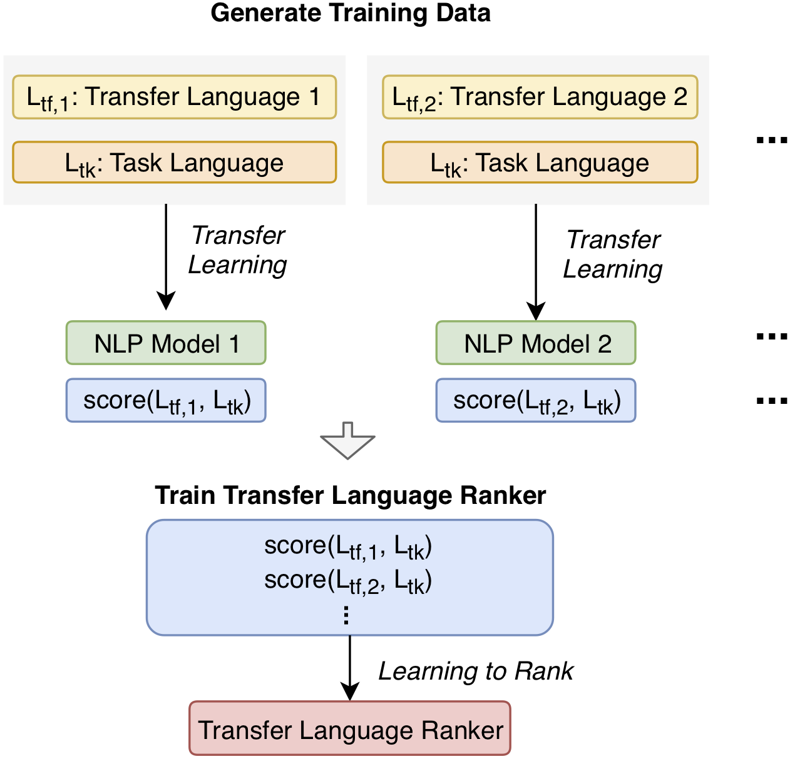
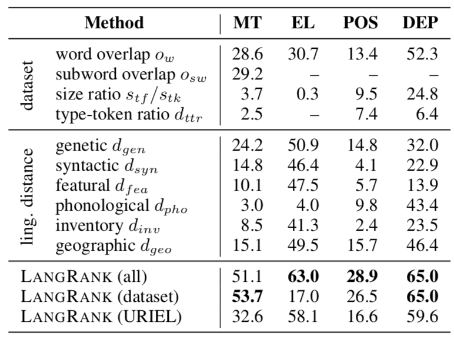

# LangRank
by [NeuLab](http://www.cs.cmu.edu/~neulab/) @ [CMU LTI](https://lti.cs.cmu.edu)

LangRank is a program for **Choosing Transfer Languages for Cross-lingual Transfer Learning**, described by our [paper](https://arxiv.org/abs/1905.12688) on the topic at ACL 2019.
Cross-lingual transfer, where a high-resource *transfer* language is used to improve the accuracy of a low-resource *task* language, is now an invaluable tool for improving performance of natural language processing (NLP) on low-resource languages.
However, given a particular task language, it is not clear *which* language to transfer from, and the standard strategy is to select languages based on *ad hoc* criteria, usually the intuition of the experimenter.
Since a large number of features contribute to the success of cross-lingual transfer (including phylogenetic similarity, typological properties, lexical overlap, or size of available data), even the most enlightened experimenter rarely considers all these factors for the particular task at hand.

LangRank is a program to solve this task of automatically selecting optimal transfer languages, treating it as a ranking problem and building models that consider the aforementioned features to perform this prediction.
For example, let's say you have a *machine translation* (MT) task, and you want to know which languages/datasets you should use to build a system for the low-resource language *Azerbaijani*.
In this case, you would prepare an example of the type of data you want to translate (in word and sub-word format, details below), and the language code "aze", then run a command like the following (where `-n 3` are the top 3 languages):

    python3 langrank_predict.py -o word-data.aze -s subword-data.aze -l aze -n 3 -t MT

which would give you results like the following, showing which related datasets to transfer from, and why the model chose those datasets:

    Ranking (top 3):
    1. ted_tur : score=-0.01
        1. Transfer over target size ratio : score=0.40;
        2. Transfer lang dataset size : score=0.40;
        3. Overlap word-level : score=0.18
    2. ted_ara : score=-0.63
        1. Transfer over target size ratio : score=0.25;
        2. Transfer target TTR distance : score=0.17;
        3. Overlap word-level : score=0.10
    3. ted_aze : score=-1.67
        1. Transfer target TTR distance : score=0.12;
        2. Overlap word-level : score=0.06;
        3. SYNTACTIC : score=0.06

In experiments on representative NLP tasks such as machine translation, entity linking, POS tagging, and dependency parsing, we have found that LangRank predicts good transfer languages much better than *ad hoc* baselines considering single features in isolation.
Try it out below if you want to figure out which language you should be using to solve your low-resource NLP task!

## Installation

Steps to install:

First install the latest version (1.1.6) of lang2vec:

    git clone https://github.com/antonisa/lang2vec.git
    cd lang2vec
    wget http://www.cs.cmu.edu/~aanastas/files/distances.zip .
    mv distances.zip lang2vec/data/
    python3 setup.py install

or use the test PyPI distribution as follows:

    pip install -i https://test.pypi.org/simple/ lang2vec
    
Now clone and install langrank (future: install it as module)

    cd ../
    git clone https://github.com/neulab/langrank.git
    cd langrank
    pip install -r requirements.txt
    wget http://phontron.com/data/langrank/indexed.tar.gz  .
    tar -xzvf indexed.tar.gz
    rm indexed.tar.gz

## Predicting Transfer Languages

You can run ``langrank_predict.py`` to predict transfer languages by providing an unsegmented dataset, a segmented dataset
(using [sentencepiece](https://github.com/google/sentencepiece)), the language code of your datasets, and the NLP task on hand.
    
    python3 langrank_predict.py -o sample-data/ted-train.orig.aze -s sample-data/ted-train.orig.spm8000.aze -l aze -n 3 -t MT

The supported NLP tasks include: machine translation (MT), entity linking (EL), part-of-speech tagging (POS), and dependency parsing (DEP).

A detailed walk-through of ``langrank_predict.py`` is provided below. (ran in the ``langrank`` directory):

    python3
    >>> import langrank as lr
    >>>
    >>> # Load some data
    >>> with open("sample-data/ell.tok") as inp:
    ...     lines = inp.readlines()
    ... 
    >>> # Just to show that we loaded something
    >>> len(lines) 
    10133 
    >>> lines[0]
    "o milissi c' e cikala isan adèrfia .\n"
    >>> 
    >>> # Now prepare the dataset
    >>> prepared = lr.prepare_new_dataset('ell', task="MT", dataset_source=lines)
    NOTE: no subword-level dataset provided, will only extract word-level features.
    >>>
    >>> # And rank the candidates (this could be set to 'all' so that it would rank all available datasets)
    >>> lr.rank(prepared, task='MT' candidates=['tur','ara', 'aze'])
    Ranking (top 3):
    1. ted_tur : score=-0.01
        1. Transfer over target size ratio : score=0.40;
        2. Transfer lang dataset size : score=0.40;
        3. Overlap word-level : score=0.18
    2. ted_ara : score=-0.63
        1. Transfer over target size ratio : score=0.25;
        2. Transfer target TTR distance : score=0.17;
        3. Overlap word-level : score=0.10
    3. ted_aze : score=-1.67
        1. Transfer target TTR distance : score=0.12;
        2. Overlap word-level : score=0.06;
        3. SYNTACTIC : score=0.06

## Data

We have also made public in an easy-to-browse format the [raw data that went into training the model](https://docs.google.com/spreadsheets/d/1yo9Zlnk_oMRshZeUMCHQmztnuC6VOCnP0wsgD7adRYQ/edit?usp=sharing).
We have released data for MT, EL, POS tagging, and dependency parsing as described in the paper, and also some additional data for zero-shot MT.
This may be easy to browse if you'd like to see, for example, which languages we empirically found the most useful for transferring into other languages.

## Citation/Acknowledgements

If you use LangRank, we'd appreciate if you cite the [paper](https://arxiv.org/abs/1905.12688) about it!

    @inproceedings{lin19acl,
        title = {Choosing Transfer Languages for Cross-Lingual Learning},
        author = {Yu-Hsiang Lin and Chian-Yu Chen and Jean Lee and Zirui Li and Yuyan Zhang and Mengzhou Xia and Shruti Rijhwani and Junxian He and Zhisong Zhang and Xuezhe Ma and Antonios Anastasopoulos and Patrick Littell and Graham Neubig},
        booktitle = {The 57th Annual Meeting of the Association for Computational Linguistics (ACL)},
        address = {Florence, Italy},
        month = {July},
        year = {2019}
    }

LangRank was supported by NSF Award #1761548 "Discovering and Demonstrating Linguistic Features for Language Documentation", and the DARPA Low Resource Languages for Emergent Incidents (LORELEI) program under Contract No. HR0011-15-C0114.
